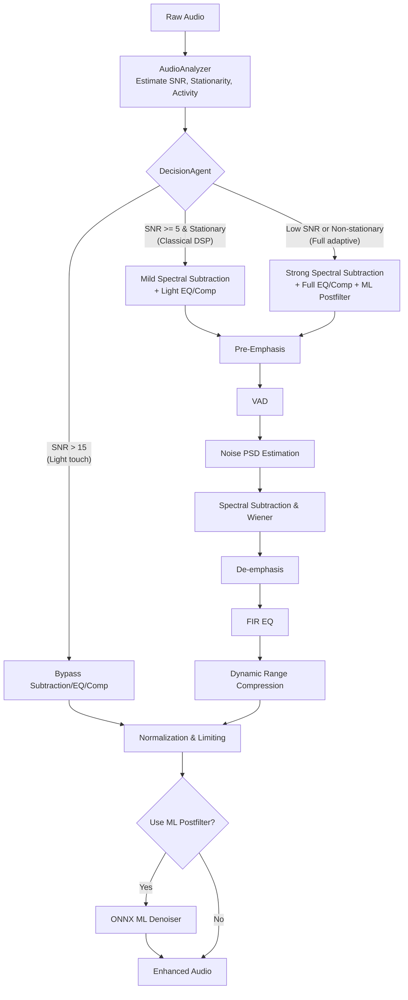
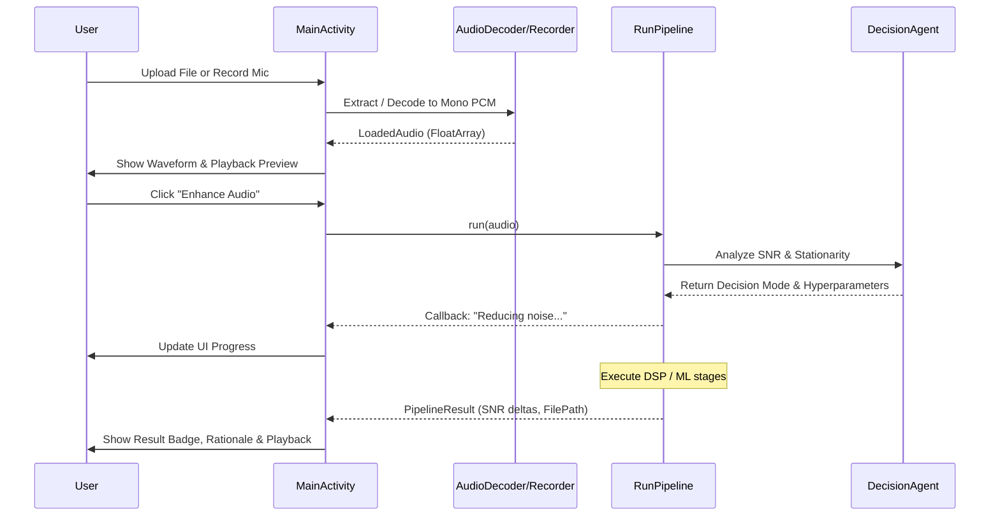

# SignalChain Technical Overview

## 1. Project Summary

SignalChain is a comprehensive, fully on-device speech enhancement application built for native Android using Kotlin. It is designed to take noisy audio input (either uploaded files or live microphone recordings), analyze its signal-to-noise ratio (SNR) and stationarity, and dynamically apply an intelligent pipeline of classical Digital Signal Processing (DSP) and Machine Learning (ML) techniques to enhance speech quality before outputting a cleaned WAV file.

While the project originally began as a cloud-dependent Python reference implementation (using Flask and classical Python DSP/ML scripts), it has since fully pivoted to a native Android Kotlin application. All processing now happens entirely on-device, with no cloud backend or external server dependencies. Explicitly out of scope for the current Android build are Speech-to-Text (STT) transcription (which exists only as a legacy/ablation feature in the offline Python code), iOS support, and real-time streaming latency (the app currently processes audio in block-mode rather than as a live stream).

## 2. Architecture Overview

Because the project has transitioned from a Python backend to an on-device Kotlin application, there is **no heavy backend or cloud server** associated with SignalChain. The architecture is divided into the live Android app code, the offline training/ablation scripts, and legacy code.

### On-Device Runtime Code (Kotlin)
*   **`MainActivity.kt`**: The core orchestrator and UI layer, built with Jetpack Compose. Handles user input, permissions, recording, and displays pipeline progress, history, and results.
*   **`pipeline/RunPipeline.kt`**: The high-level execution script that sequences the DSP, ML, and routing logic on the full audio array.
*   **`agent/DecisionAgent.kt`**: Determines the enhancement strategy ("Light touch", "Classical DSP", or "Full adaptive") based on SNR, stationarity, and speech activity.
*   **`agent/AudioAnalyzer.kt`**: Analyzes the raw audio to compute the metrics (SNR, noise stationarity) used by the `DecisionAgent`.
*   **`dsp/PreEmphasis.kt`**: Applies and reverses pre-emphasis filtering.
*   **`dsp/Vad.kt`**: Performs Voice Activity Detection based on frame energy and zero-crossing rates.
*   **`dsp/NoisePsd.kt`**: Estimates the Power Spectral Density (PSD) of the noise from non-speech frames.
*   **`dsp/SpectralSubtraction.kt`**: Performs Wiener filtering and spectral subtraction.
*   **`dsp/Eq.kt`**: Applies frequency band boosting and high/low-pass FIR filtering.
*   **`dsp/Compressor.kt`**: Handles dynamic range compression and final audio normalization/limiting.
*   **`dsp/SnrEstimator.kt`**: Estimates SNR before and after processing.
*   **`dsp/Fft.kt`**: Custom implementation of FFT, STFT, and ISTFT for the DSP pipeline.
*   **`ml/OnnxDenoiser.kt`**: Wraps the ONNX Runtime Mobile inference for the CNN spectral-mask denoiser.
*   **`audio/AudioDecoder.kt`**: Uses Android's `MediaCodec` to decode various user-uploaded audio formats into mono float PCM.
*   **`audio/AudioPlayer.kt`**: Manages audio playback for the before/after comparisons.
*   **`audio/AudioRecorder.kt`**: Handles direct microphone recording.
*   **`audio/WavLoader.kt` & `audio/WavWriter.kt`**: Utilities for reading and writing PCM WAV files.
*   **`ui/WaveformView.kt`**: Custom Compose UI component for rendering the audio waveform.

### Offline / Training-Only Code (Python)
These scripts are used exclusively on developer machines for training and ablation, never shipping in the APK:
*   **`train_denoiser.py`**: PyTorch script for training the spectral-mask denoiser CNN using LibriSpeech and synthetic noise.
*   **`trained_ml_denoiser.py`**: Defines the PyTorch `SpectralMaskDenoiser` model architecture.
*   **`export_onnx.py`**: Exports the trained PyTorch model to the `.onnx` format used by the Android app.
*   **`ablation_runner.py`**: Runs reproducible ablations comparing DSP-only, DSP+ML, and Agent pipelines, evaluating with STOI and STT proxies.
*   **`make_ablation_testset.py`**: Generates the deterministic, held-out LibriSpeech test set.
*   **`mix_noisy_speech.py`**: Utility for mixing clean speech with noise.
*   **`self_eval.py`**: Computes STOI scores using `pystoi`.
*   **`run_stats.py`**: Analyzes and aggregates run statistics.

### Dead / Unused / Legacy Code
These files represent the previous iteration of the project and are currently unused by the Android application:
*   **`app.py` & `templates/`**: The deprecated Flask web server and its UI templates.
*   **`dsp_pipeline.py` & `agent_analyzer.py` & `decision_agent.py` & `ml_postfilter.py`**: The original Python implementations of the DSP and agent logic.
*   **`stt_module.py`**: Legacy Speech-to-Text module (used only as a proxy in `ablation_runner.py`).
*   **`voice_enhancer.py` & `voice_enhancer.m`**: Old prototyping scripts.

## 3. DSP Pipeline (Classical Signal Processing)

The classical DSP chain is entirely implemented natively in Kotlin, processing the audio in sequential blocks. The pipeline is highly dynamic; the `DecisionAgent` adjusts hyperparameters or bypasses stages entirely based on the input signal characteristics.

1.  **Pre-emphasis (`PreEmphasis.kt`)**: Applies a high-pass filter (coefficient typically 0.97) to amplify high frequencies.
2.  **VAD (`Vad.kt`)**: Detects speech frames using energy thresholds and zero-crossing rates, with an adjustable hangover duration to prevent clipping speech tails.
3.  **Noise PSD Estimation (`NoisePsd.kt`)**: Averages the magnitude squared of the STFT over frames identified as noise (non-speech) by the VAD.
4.  **Spectral Subtraction (`SpectralSubtraction.kt`)**: Subtracts the estimated noise PSD from the signal's magnitude spectrum, guided by an over-subtraction factor (`alpha`) and a spectral floor (`beta`). Applies temporal gain smoothing.
5.  **De-emphasis (`PreEmphasis.kt`)**: Reverses the pre-emphasis filter.
6.  **EQ (`Eq.kt`)**: An FIR filter that can apply band boosts, a high-pass filter at 80 Hz (rumble removal), and a low-pass filter at 8 kHz.
7.  **Compression & Normalization (`Compressor.kt`)**: Applies dynamic range compression with a configurable ratio and makeup gain, followed by peak normalization and limiting to prevent clipping.
8.  **SNR Estimation (`SnrEstimator.kt`)**: Calculates the final SNR of the processed audio.



## 4. ML Pipeline

The Machine Learning component is a Convolutional Neural Network (CNN) trained to predict a spectral mask. It acts as a post-filter for severely degraded audio.

### On-Device Inference
In `ml/OnnxDenoiser.kt`, the pipeline invokes the ONNX Runtime Mobile engine.
*   **Preprocessing**: The input audio is linearly resampled to 16 kHz. It is then transformed via a centered STFT (`n_fft=512`, `hop=128`) with reflective padding. The magnitude is compressed using `log1p`.
*   **Inference**: The `spectral_mask_denoiser.onnx` model predicts a mask from the log-magnitude spectrum.
*   **Postprocessing**: The mask is multiplied against the complex STFT, followed by an ISTFT and linear resampling back to the original sample rate.
*   **Fallback**: If the ML execution fails (e.g., due to memory constraints), `RunPipeline.kt` catches the exception and safely falls back to the DSP-only output.

### Offline Training
The `train_denoiser.py` script trains a PyTorch `SpectralMaskDenoiser`. The training data mimics the exact input the ML model will see during inference: the network is fed audio that has *already* passed through the classical DSP frontend (Wiener filter, EQ, compression), and it learns to predict a mask that maps this DSP-processed audio back to the original clean target.

```mermaid
flowchart TD
    DSP[DSP Pipeline Output] --> Resample1[Resample to 16 kHz]
    Resample1 --> STFT[Centered STFT\nn_fft=512, hop=128]
    STFT --> Mag[Magnitude Calculation\nlog1p(abs(S))]
    
    Mag --> ONNX[ONNX Runtime\nCNN Mask Prediction]
    
    STFT --> Mult((Multiply))
    ONNX --> Mult
    
    Mult --> ISTFT[Centered ISTFT]
    ISTFT --> Resample2[Resample to Original Rate]
    Resample2 --> Out[Enhanced Output]
```

## 5. Mobile App / UI Layer

SignalChain uses Jetpack Compose for its UI, providing a seamless user flow for processing audio.

*   **Audio Ingestion**: Users can upload files via the Android file picker or record directly using the microphone (`AudioRecorder.kt`). `AudioDecoder.kt` uses Android's `MediaCodec` to decode almost any supported audio format into float PCM, bypassing strict WAV limitations.
*   **UI Components**: The `MainActivity.kt` orchestrates the experience. It includes interactive visualizations like `WaveformView.kt`, which draws amplitude peaks.
*   **Live Feedback**: The UI surfaces active execution states (e.g., "Analyzing signal", "Reducing noise", "Running ML post-filter") natively while `RunPipeline.kt` executes.
*   **Results & Playback**: Users can play back the "Before" and "After" audio tracks sequentially using `AudioPlayer.kt`, view the estimated SNR delta, and inspect the specific rationale the `DecisionAgent` used to process the file.



## 6. Datasets Used for Training

Based on the repository's configuration and training scripts, the following datasets are used:

*   **LibriSpeech (`dev-clean`)**: This is the sole source of clean speech referenced in the repository. It is utilized by `train_denoiser.py` to source the target audio, and by `make_ablation_testset.py` to create the evaluation splits.
*   **Synthetic Noise Generator**: SignalChain does not use external noise corpora like DEMAND. Instead, `train_denoiser.py` dynamically synthesizes four types of noise during training: white noise, brown hum (low-frequency), tonal noise (sine waves), and non-stationary bursts (envelope-modulated white noise).

*Note: The NOIZEUS dataset is completely absent from the codebase and is not used for training or evaluation.*

## 7. Known Limitations / Honest Gaps

A strict audit of the codebase reveals several genuine limitations:

1.  **Block Processing Latency**: The app is not a real-time streaming system. `RunPipeline.kt` processes the entire `FloatArray` in memory at once. While it runs locally on-device, it incurs full-file latency.
2.  **Hardcoded Routing Thresholds**: The `DecisionAgent.kt` relies on rigid, hardcoded thresholds (e.g., `snr > 15`, `snr >= 5`). These heuristics may fail on edge-case audio environments.
3.  **Resampling Bottleneck**: The ML denoiser operates exclusively at 16 kHz. `OnnxDenoiser.kt` performs linear resampling on the CPU up to 16 kHz and back, which is computationally expensive and potentially degrades frequencies above 8 kHz in high-fidelity recordings.
4.  **Lack of Automated Testing**: There are no JUnit or Android instrumented tests present in the `signalchain-android` module. The Kotlin DSP algorithms are untested outside of manual app usage.
5.  **ML Fallback**: If the ONNX runtime encounters an OOM (Out of Memory) or dimension mismatch error, `RunPipeline.kt` catches the exception and falls back to the DSP output. This means users with low-memory devices might unknowingly bypass the ML stage.

## 8. Comparison Table vs. the Reference Paper

Below is an honest comparison between the framework proposed in *"Optimizing speech quality and intelligibility through noise-aware enhancement for coding application"* (Anees et al., 2026) and the current state of SignalChain.

| Dimension | Anees et al. (2026) | SignalChain |
|---|---|---|
| **Deployment target** | Research paper codebase (no application). | Fully native, on-device Android Kotlin app. |
| **Enhancement strategy** | Fixed pool of 3 classical algorithms (MCRA/WSA/SMA) chosen based on noise type. | SNR and stationarity-based routing ("Light touch", "Classical DSP", "Full adaptive") modifying hyperparameters of a unified Wiener filter + EQ + Compressor pipeline. |
| **ML component** | CNN acts only as an upstream noise-*type* classifier to select the DSP algorithm. | CNN acts as a direct spectral-mask denoiser to enhance audio severely degraded by noise. |
| **Objective evaluation** | NCM/PESQ on NOIZEUS, restricted to 3 noise types and 12 test samples. | Offline ablation scripts use STOI on a held-out split of LibriSpeech. No standard NCM/PESQ metrics have been run. |
| **End-to-end product** | No — research pipeline only. | Yes — features file upload, mic recording, MediaCodec decoding, live progress UI, and waveform playback. |
| **Latency/real-time** | Reported ~22.5ms/frame in isolated benchmark; no full-system real-time claim. | Not real-time. Processes the entire audio file in block-mode. |
| **Reproducibility / dataset scale** | 270 base recordings, 1080 after augmentation, 3 noise types only. | Evaluated on thousands of LibriSpeech `dev-clean` samples dynamically mixed with 4 synthetic noise distributions. |
| **Known weaknesses** | Agent-guided system still trails the unprocessed baseline on specific SNR/noise combinations. | Not real-time; hardcoded SNR thresholds; linear resampling bottlenecks; lacks standard benchmark evaluations (PESQ) to definitively prove superiority. |

### Conclusion on the Comparison
SignalChain is currently **ahead** in terms of practical engineering and productization. It is a shipped, fully self-contained Android application capable of interacting with standard device codecs and microphones, whereas the paper describes an isolated research script. Furthermore, SignalChain applies its ML model directly to the denoising task, rather than just using it to flip switches. 

However, SignalChain is currently **behind** in rigorous academic validation. The lack of standard objective metrics (like PESQ or NCM) evaluated against a recognized benchmark dataset (like NOIZEUS or VoiceBank-DEMAND) means we cannot definitively claim it produces higher quality audio than the paper's method. The single most valuable next step for the project would be to run the exact Kotlin DSP/ML pipeline through a JNI/offline wrapper against the NOIZEUS dataset and compute PESQ and STOI scores, allowing for an apples-to-apples numerical comparison.
